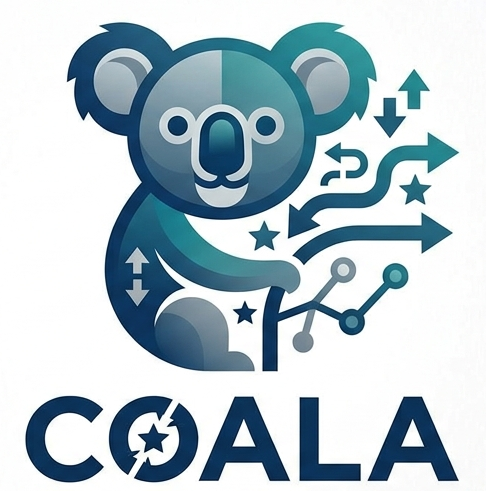

<table border="0" cellpadding="0" cellspacing="0">
<tr>
<td width="70%" valign="middle">

<h1>COALA</h1>

<b>Convex Optimization for Alignment and Preference Learning</b><br>
A lightweight, reference-free framework for preference fine-tuning on a single GPU.

<p>
  <a href="paper/Coala_preflearn_icml2026.pdf"></a>
  
  
  
</p>

</td>
<td width="30%" valign="middle" align="right">

</td>
</tr>
</table>

---

COALA (`Convex Optimization for Alignment and preference Learning Algorithm`) re-casts
preference fine-tuning of large language models as a convex program
over the last layer of a two-layer ReLU network (`cvxNN`) stacked on top of a
pre-trained backbone. By replacing the non-convex DPO objective with a convex
reformulation that admits an ADMM solver (`CRONOS`), COALA

  - eliminates the reference model required by DPO (cutting VRAM by `~2x`),
  - reaches stable, monotonically increasing reward margins in as little as `~17.6%` of DPO's TFLOPs,
  - runs end-to-end on a single RTX 4090 (24 GB), and
  - inherits the convergence guarantees of convex programming — no `1e-9` learning
    rates, no grid-searched hyperparameters.

Across five backbones (`DistilGPT2`, `GPT-2`, `Mistral-7B`, `Dolphin-2.6-7B`, `LLaMA-3.2-3B`, 
`LLaMA-3.1-8B`) and three datasets (`EduFeedback`, `UltraFeedback`, `IMDb`, `HelpSteer`),
COALA matches or beats DPO and ORPO on AlpacaEval2 length-controlled win rate,
and wins 39.1% / 42.7% of head-to-head multiple choice matchups against competing methods in our 107-person human study (paper Table 2).

A summary of the practical use-cases, method, derivations, proofs and experiments
are in [`paper/Coala_preflearn_icml2026.pdf`](paper/Coala_preflearn_icml2026.pdf).

## Method

For a pre-trained backbone `f_pre`, COALA stacks a convex two-layer ReLU network
`g_{Θ_1, θ_2}` on the frozen features and trains it in two phases:

  1. **Phase I — CRONOS.** Solve the convex reformulation of the two-layer ReLU
     network (Pilanci & Ergen 2020) by ADMM with preconditioned conjugate
     gradients. Produces `(Θ_1, θ_2)` with an `O(1/K)` convergence guarantee.
  2. **Phase II — Convex preference fine-tuning.** Freeze `Θ_1`. The reference-free
     COALA loss is

     ```
     min_{θ_2}  E [ log( 1 + exp( -β y_w θ_2^T (Θ_1 f_pre(x))_+ + γ ) ) ]
     ```

     which is convex in `θ_2` and solved by AdamW with an `O(1/k^2)`
     accelerated-gradient guarantee (Theorem 4.3).

The implementation is in JAX with `jit` compilation; the ADMM subproblems
reduce to a vector add and one matvec, which the JAX backend
parallelises efficiently on a single GPU.

## Repository layout

```
COALAgit/
├── paper/                         # ICML 2026 manuscript
├── solve/                         # CRONOS solve skeleton core
│   ├── models/                    #   cvx_mlp, cvx_relu_mlp, two_layer_mlp, get_model
│   ├── optimizers/                #   admm, pcg, adamW, dadapt_adamW, varpro
│   ├── preconditioner/            #   nystrom
│   ├── training/                  #   train
│   ├── experiments/               #   lr_experiment
│   └── utils/                     #   gpt2_dataloader, model_utils, opt_utils,
│                                  #   metric_utils, proximal_utils, linops_utils,
│                                  #   train_utils
│
├── extract.py                     # Stage 1 — feature extraction (chosen / rejected)
├── extract_prep_prefdata.py       #         preference-data prep for extract.py
├── LMdata_utils.py                #         dataset / collator classes used by extract.py
│
├── cronos_trainer.py              # Stage 2 — Phase I (CRONOS, Algorithm 2)
├── defrun.py                      #         run wrapper for CRONOS
│
└── finetune_coala.py              # Stage 3 — Phase II (COALA loss, Algorithm 1)
```

This is the *minimal* pipeline. Baseline scripts (DPO / ORPO / SFT),
evaluation drivers, paper plotting code, and the multi-backbone batch scripts
that ran the full paper excluded here
to keep the canonical reference clean.


## Quickstart

The three-stage pipeline reproduces COALA on a single dataset / backbone pair.

```bash
# (Optional, only if your preference data is in JSON pairs) — prep into pos/neg txt
python extract_prep_prefdata.py

# Stage 1 — extract frozen features (chosen / rejected)
python extract.py \
    --model_path  <hf-model-or-sft-ckpt> \
    --data_path   datasets/<your-dataset>/ \
    --pool        attn \
    --output_base extracted_features/

# Stage 2 — Phase I: train cvxNN via CRONOS (ADMM)
python cronos_trainer.py --model_name <model_name>

# Stage 3 — Phase II: convex preference fine-tune θ_2
python finetune_coala.py \
    --model_path  cvxNN_trained_<model_name>/ \
    --output_dir  Finetuned_cvxmlp_<model_name>/
```

> **Note.** Several scripts contain absolute paths (e.g. `/home/miria/COALA/...`)
> from the original development environment. This will be fixed in the future

## Data

  - **EduFeedback** — `26,621` GPT-4o-generated tutor conversations across 11
    fields of study (introduced in this paper, paper §5.1 and Appendix E.3).
    The *Alternating Population Strategy* expands these to `65,606` preference
    triplets without an external reward model [https://huggingface.co/datasets/miria0/EduFeedback](https://huggingface.co/datasets/miria0/EduFeedback). 


## Citation

If COALA was helpful in your work, please cite

```bibtex
@inproceedings{feng2026coala,
  title     = {Convex Optimization for Alignment and Preference Learning on a Single GPU},
  author    = {Feng, Miria and Pilanci, Mert},
  booktitle = {Proceedings of the 43rd International Conference on Machine Learning},
  year      = {2026},
  series    = {Proceedings of Machine Learning Research},
  publisher = {PMLR},
}
```

The convex reformulation and CRONOS solver underpinning Phase I are due to:

  - Pilanci & Ergen, *Neural Networks are Convex Regularizers: Exact Polynomial-time Convex Optimization Formulations for Two-layer Networks*, ICML 2020.
  - Feng, Frangella & Pilanci, *CRONOS: Enhancing Deep Learning with Scalable
    GPU-Accelerated Convex Neural Networks*, NeurIPS 2024.

